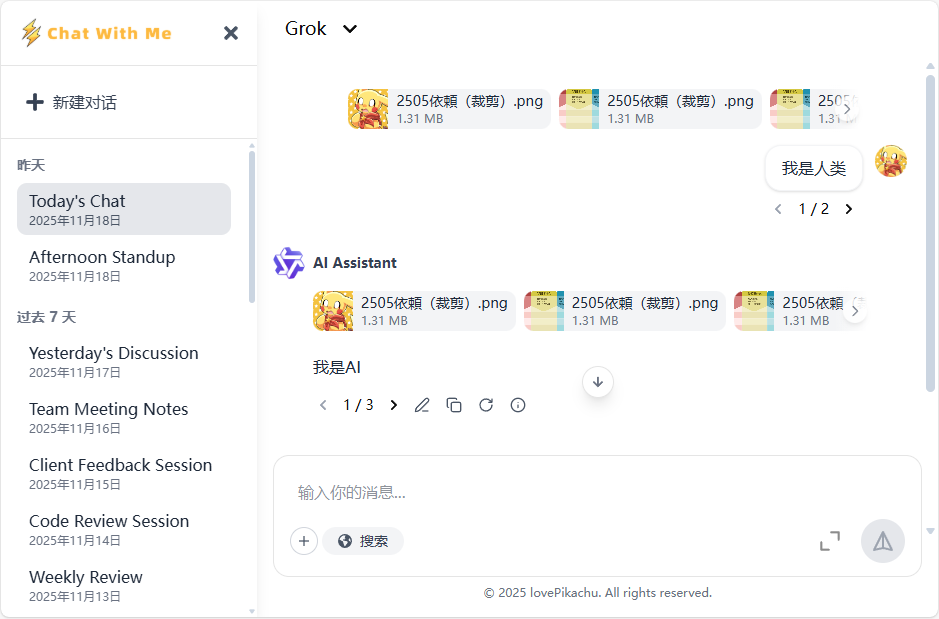

<div align="center">

<br/><br/>

  <h1 align="center">
    Chat With Me
  </h1>
  <h4 align="center">
    一 个 简 单 易 用 的 大 语 言 模 型 前 端 对 话 模 板
  </h4>

<p align="center">
    <a href="#">
        
    </a>
    <a href="#">
        
    </a>
    <a href="#">
        
    </a>

</p>



</div> 

# 项目简介

> **⚠️注意** 该项目的代码大部分由 AI 生成，而界面中的小细节与功能设计是由我撰写的，所以开发中若遇到一些不必要的代码、可优化的代码欢迎提交
> Issue 批评和提交 PR 优化。

Chat With Me 是一个简单的大语言模型文本对话的前端，其设计理念为 “少写前端，一切由后端控制” ，非常适合个人项目搭建和学校毕设。

项目基于 React 19 的现代化前端项目，采用 Vite 作为构建工具，Tailwind CSS 配合 Radix UI 和 Headless UI 构建可访问、高颜值的
UI 组件，结合 Zustand 进行状态管理，支持 Markdown 富文本编辑与渲染（含数学公式和代码高亮），并集成 i18next 实现国际化。

# 设计说明

## 宏定义说明

在配置文件 `vite.config.js` 中，存在一个宏定义 `DEBUG_MODE` ，该宏定义用于设置是否为调试模式，在调试模式下，前端将会暴露
`emitEvent` 函数用于测试广播。

## 接口配置

请求接口配置文件在 `src/config.js` ，其中定义了 HTTP 的请求接口和 WebSocket 的连接接口，其中 **HTTP 请求** 主要用于 *
*配置数据的获取** 和 **内容的获取** （例如历史对话、历史消息等），对于 **WebSocket** 主要用于 **实时对话生成** 、 **命令控制
** （通过广播控制前端行为），需要配置如下所有接口前端才能工作（只要不是404就行）。

在项目 test 文件夹下我使用 fastapi 搭建了一个非常潦草的接口示例。

## 服务器响应

服务器应该按照如下的 Rest API 响应数据，接口定义可在 `src/lib/apiClient.js` 修改：

```python
{
    "success": True,
    "code": 200,
    "msg": "请求成功",
    "data": None  # 主要内容载体，如果没有数据 data 不会存在
}
```

## 广播理念

> 💡 广播的定义在 `src/store/useEventStore.jsx` 中，对于处理 WebSocket 的消息在 `src/context/ContextEvent.jsx` 代码中。

**WebSocket** 发送的内容将会被视为广播，广播事件主要用于控制前端界面控件或者在代码中用于事件绑定，一个事件的源数据如下：

```python
{
    "type": "",  # string: message/widget/page/websocket
    "target": "",  # string: 目标接收者
    "payload": {},  # object: 参数，具体查看相关事件的说明
    "markId": None,  # string: 会话标记，空则广播到所有会话
    "id": "",  # string: 事件 ID（发出方生成），部分事件需要等待回复，回复时需要携带与发出方一样
    "isReply": False,  # boolean: 是否为回复
    "fromWebsocket": False,  # boolean: 是否来自 WebSocket（防止回传）
    "notReplyToWebsocket": False  # boolean: 回复信息是否要发送到 ws
}
```

# Markdown 额外语法

```
:::card{type=processing id=123}
content
:::
```

id 用于确保在前端可以正常展开卡片，一定要传入 id

语言名称：card{type=processing}
用于展示加载卡片，，当单独一行为 `[DONE]` 时，表示处理完成，加载卡片会把最新的一行展示在卡片上。

语言名称：card{type=thinking}
用于展示思考卡片，当单独一行为 `[DONE]` 时，表示思考完成。

语言名称：card{type=invisible}
里面的内容全部隐藏

# 接口说明

## CHATBOX_ENDPOINT - ChatBox 配置接口

用于配置 ChatBox 对话界面的工具栏、提示行为及附件功能等基本属性。该接口通过一个结构化字典定义用户交互工具的布局与行为，支持内置工具按钮、扩展菜单项、提示信息、只读模式等配置。

### 接口结构

```python
{
    "builtin_tools": [
        # 内置工具按钮配置列表（推荐不超过3个）
    ],
    "extra_tools": [
        # 扩展菜单项配置列表（支持多种类型）
    ],
    "readOnly": True,  # 是否为只读模式，True时禁用输入框
    "tipMessage": "text or null",  # 输入框上方的提示文本，None 表示无提示
    "tipMessageFadeOutDelay": None,  # 提示自动消失的延迟时间（毫秒），None 或未提供则永久显示
    "ignoreAttachmentTools": False,  # 是否隐藏附件上传按钮（如图片、文件上传）
}
```

### 1. builtin_tools 配置

显示在输入框**左侧的常驻工具按钮**，推荐配置 **不超过 3 个**，超出可能导致界面排版错乱。可为空列表 `[]`。

#### 按钮配置项（每个元素为字典）

| 字段         | 类型     | 必填 | 说明                                    |
|------------|--------|----|---------------------------------------|
| `name`     | `str`  | 是  | 按钮唯一标识符，发送消息时会携带此字段用于标识工具启用状态         |
| `text`     | `str`  | 是  | 按钮上显示的文本标签                            |
| `iconType` | `str`  | 是  | 图标类型，支持：`"library"`、`"svg"`、`"image"` |
| `iconData` | `str`  | 是  | 图标数据，根据 `iconType` 不同含义不同             |
| `bgColor`  | `str`  | 否  | 按钮背景颜色，默认为 `"#4F39F6"`（十六进制颜色码）       |
| `isActive` | `bool` | 否  | 是否默认处于激活状态（高亮），默认 `False`             |
| `disabled` | `bool` | 否  | 是否禁用该按钮（灰色不可点击），默认 `False`            |

#### iconType 说明

##### 1. `library` — 使用图标库（React Icons）

支持以下预定义图标名称：

- `"search"` → `FaSearch`
- `"refresh"` → `FaRedo`
- `"earth"` → `FaEarthAmericas`

```python
{
    "name": "search",
    "text": "搜索",
    "iconType": "library",
    "iconData": "search",
    "bgColor": "#4F39F6"
}
```

##### 2. `svg` — 内联 SVG 代码（自动过滤 XSS）

提供合法的 SVG 字符串，推荐使用 24×24 尺寸，单色设计。

```python
{
    "name": "custom",
    "text": "自定义",
    "iconType": "svg",
    "iconData": "<svg viewBox='0 0 24 24' fill='currentColor'><path d='M12 3v10.55c-.59-.34-1.27-.55-2-.55-2.21 0-4 1.79-4 4s1.79 4 4 4 4-1.79 4-4V7h4c0 4.42-3.58 8-8 8s-8-3.58-8-8 3.58-8 8-8h4z'/></svg>",
    "bgColor": "#FF6B6B"
}
```

##### 3. `image` — 图片 URL

提供图片的 HTTP/HTTPS URL，推荐使用 24×24 像素、1:1 比例的 PNG/SVG 图像。

```python
{
    "name": "avatar",
    "text": "头像",
    "iconType": "image",
    "iconData": "https://example.com/avatar.png",
    "bgColor": "#4ECDC4"
}
```

---

### 2. extra_tools 配置

通过输入框右侧的 **“+”按钮** 弹出的扩展菜单，支持多种交互类型。可为空列表 `[]`。

#### 菜单项通用结构（所有类型均需包含 `type` 字段）

```python
{
    "type": "toggle",  # 必须，菜单类型
    "name": "autoTranslate",  # 除 label/separator 外必须
    "text": "自动翻译",  # 显示文本
    "iconType": "library",  # 可选，图标类型
    "iconData": "earth",  # 可选，图标数据
    "disabled": True,  # 可选，是否禁用
    "default": True,  # toggle/radio 可选，默认值
    "autoClose": False  # 可选，点击后是否自动关闭菜单
}
```

> 💡 **注意**：`name` 在整个 `extra_tools` 中必须**全局唯一**，用于状态存储和交互识别。

#### 支持的菜单类型

##### 1. `toggle` — 开关型（布尔值）

- 点击切换 `true/false` 状态
- 状态路径：`toolsStatus.extra_tools[name]`
- 默认值：`False`

```python
{
    "type": "toggle",
    "name": "autoTranslate",
    "text": "自动翻译",
    "iconType": "library",
    "iconData": "earth",
    "autoClose": False
}
```

##### 2. `radio` — 单选组

- 组内只能选中一项
- 状态路径：`toolsStatus.extra_tools[name]`，值为选中项的 `name`
- 必须包含 `children`，且至少一个子项
- `default` 指定默认选中的子项 `name`

```python
{
    "type": "radio",
    "name": "language",
    "text": "语言设置",
    "iconType": "library",
    "iconData": "earth",
    "default": "en",
    "children": [
        {
            "name": "zh",
            "text": "中文",
            "iconType": "image",
            "iconData": "/flags/cn.svg"
        },
        {
            "name": "en",
            "text": "English",
            "iconType": "image",
            "iconData": "/flags/us.svg"
        }
    ]
}
```

##### 3. `label` — 标题分组（无交互）

- 仅作为菜单中的标题显示
- 无状态，无需 `name`

```python
{
    "type": "label",
    "text": "高级设置"
}
```

##### 4. `separator` — 分隔线

- 用于视觉分隔菜单项
- 无任何其他字段

```python
{
    "type": "separator"
}
```

##### 5. `group` — 嵌套分组（可多层）

- 创建子菜单容器，可包含任意类型（包括嵌套 group）
- 状态由其子项决定，自身不存储状态
- 必须包含 `text` 和 `children`，且 `children` 至少一项

```python
{
    "type": "group",
    "text": "主题设置",
    "children": [
        {
            "type": "radio",
            "name": "theme",
            "text": "主题模式",
            "children": [
                {
                    "name": "light",
                    "text": "浅色模式",
                    "iconType": "svg",
                    "iconData": "<svg viewBox='0 0 24 24' fill='currentColor'><path d='M12 3v10.55c-.59-.34-1.27-.55-2-.55-2.21 0-4 1.79-4 4s1.79 4 4 4 4-1.79 4-4V7h4c0 4.42-3.58 8-8 8s-8-3.58-8-8 3.58-8 8-8h4z'/></svg>"
                },
                {
                    "name": "dark",
                    "text": "深色模式",
                    "iconType": "svg",
                    "iconData": "<svg viewBox='0 0 24 24' fill='currentColor'><path d='M20 8.69V4h-4.69L12 .69 8.69 4H4v4.69L.69 12 4 15.31V20h4.69L12 23.31 15.31 20H20v-4.69L23.31 12 20 8.69zm-10 5.31a4 4 0 1 1 0-8 4 4 0 0 1 0 8z'/></svg>"
                }
            ]
        },
        {
            "type": "toggle",
            "name": "highContrast",
            "text": "高对比度",
            "iconType": "image",
            "iconData": "/icons/contrast.svg"
        }
    ]
}
```

> ⚠️ **嵌套规则**：
> - `group` 可嵌套任意类型（含 `group`），但建议不超过 **3 层**
> - `radio` 的 `children` 只能是普通项（`toggle`/`label`/`separator`），**不能嵌套 `group`**
> - `label` 和 `separator` 不能作为 `radio` 或 `group` 的子项（仅用于顶层或同级）

##### 状态初始化默认规则

| 类型       | 默认值                          |
|----------|------------------------------|
| `toggle` | `False`                      |
| `radio`  | `children` 中**第一个**项的 `name` |
| `group`  | 不存储状态，状态由子项决定                |

### 4. 完整配置示例

```python
{
    "builtin_tools": [
        {
            "name": "search",
            "text": "搜索",
            "iconType": "library",
            "iconData": "search",
            "bgColor": "#4F39F6"
        },
        {
            "name": "refresh",
            "text": "刷新",
            "iconType": "library",
            "iconData": "refresh",
            "bgColor": "#6C757D"
        },
        {
            "name": "translate",
            "text": "翻译",
            "iconType": "library",
            "iconData": "earth",
            "bgColor": "#198754"
        }
    ],
    "extra_tools": [
        {
            "type": "label",
            "text": "基础功能"
        },
        {
            "type": "toggle",
            "name": "autoTranslate",
            "text": "自动翻译",
            "iconType": "library",
            "iconData": "earth"
        },
        {
            "type": "separator"
        },
        {
            "type": "label",
            "text": "高级设置"
        },
        {
            "type": "group",
            "text": "主题设置",
            "children": [
                {
                    "type": "radio",
                    "name": "theme",
                    "text": "主题模式",
                    "children": [
                        {
                            "name": "light",
                            "text": "浅色模式",
                            "iconType": "svg",
                            "iconData": "<svg viewBox='0 0 24 24' fill='currentColor'><path d='M12 3v10.55c-.59-.34-1.27-.55-2-.55-2.21 0-4 1.79-4 4s1.79 4 4 4 4-1.79 4-4V7h4c0 4.42-3.58 8-8 8s-8-3.58-8-8 3.58-8 8-8h4z'/></svg>"
                        },
                        {
                            "name": "dark",
                            "text": "深色模式",
                            "iconType": "svg",
                            "iconData": "<svg viewBox='0 0 24 24' fill='currentColor'><path d='M20 8.69V4h-4.69L12 .69 8.69 4H4v4.69L.69 12 4 15.31V20h4.69L12 23.31 15.31 20H20v-4.69L23.31 12 20 8.69zm-10 5.31a4 4 0 1 1 0-8 4 4 0 0 1 0 8z'/></svg>"
                        }
                    ]
                },
                {
                    "type": "toggle",
                    "name": "highContrast",
                    "text": "高对比度",
                    "iconType": "image",
                    "iconData": "/icons/contrast.svg"
                }
            ]
        },
        {
            "type": "radio",
            "name": "language",
            "text": "语言设置",
            "iconType": "library",
            "iconData": "earth",
            "default": "en",
            "children": [
                {
                    "name": "zh",
                    "text": "中文",
                    "iconType": "image",
                    "iconData": "/flags/cn.svg"
                },
                {
                    "name": "en",
                    "text": "English",
                    "iconType": "image",
                    "iconData": "/flags/us.svg"
                },
                {
                    "name": "ja",
                    "text": "日本語",
                    "iconType": "image",
                    "iconData": "/flags/jp.svg"
                }
            ]
        },
        {
            "type": "separator"
        },
        {
            "type": "group",
            "text": "更多设置",
            "children": [
                {
                    "type": "toggle",
                    "name": "notifications",
                    "text": "消息通知"
                },
                {
                    "type": "toggle",
                    "name": "sound",
                    "text": "声音提示"
                }
            ]
        }
    ],
    "readOnly": False,
    "tipMessage": "请输入您的问题，支持文件上传和智能搜索",
    "tipMessageFadeOutDelay": 5000,  # 5秒后自动消失
    "ignoreAttachmentTools": False
}
```

#### 5. 返回格式说明

上述测试配置在点击之后，发送消息的广播的 payload 的 `toolsStatus` 字段为如下格式（具体内容查看广播的发送消息事件）：

```python
{
    "builtin_tools": {
        "search": False,
        "refresh": True,
        "translate": True
    },
    "extra_tools": {
        "autoTranslate": True,
        "language": "ja",
        "themeSetting": {
            "language": "en",
            "highContrast": False,
            "test": False,
            "highContrast2": True,
            "test2": False
        }
    }
}
```

## UPLOAD_ENDPOINT - 文件上传接口（附件格式说明）

前端默认会 `POST` 表单的 `file` 字段，服务器需要响应如下格式的内容：

```python
{
    "preview": "/src/assets/test.png",  # 预留图
    "previewType": "image",  # 展示格式，如果为 svg ，preview 为 svg 代码
    "name": "示例图片.jpg",  # 展示的名称
    "size": 2048000,  # 文件大小
    "serverId": "img_67890",  # 服务器中的文件ID，前端删除附件时需要用到这个
    "downloadUrl": "https://example.com/images/img_67890"  # 点击之后文件的下载链接
}
```

## CHAT_CONVERSATIONS_ENDPOINT - 历史对话获取接口

前端默认 GET 请求该接口，该接口需要将返回数据的 data 字段设置为一个列表：

```python
[
    {
        "updateDate": "2025-03-18T20:46:00+08:00",  # 更新时间（ISO 8601 格式，带时区 +08:00）前端基于此排序
        "title": "Legacy System Update",  # 对话标题
        "markId": "mark23"  # 对话ID
    },
    # ...
]
```

## CHAT_MODELS_ENDPOINT - 模型获取接口 （模型信息源数据）

前端默认 GET 请求该接口，请求时会携带 `markId` 的 参数，如果没有 markId 就不携带。后端需要响应一个列表，每个项目是模型信息源数据：

```python
{
    'id': 'qwen',  # 模型ID，消息发送时会携带这个模型ID
    'name': 'Qwen',  # 显示的名字
    'description': 'Built by qwen',  # 介绍
    'avatar': '/src/assets/AI.png',  # 模型头像
    'tags': ["Code", "Chat"]  # 模型标签
}
```

## CHAT_MESSAGES_ENDPOINT - 消息获取接口 （消息源数据）

前端默认 GET，提供表单：

- markId 目前的对话ID
- prevId 目前最早的一条消息的ID，如果没有提供则目前没有消息（可选，默认）
- nextId 前端没有的消息Id，要向后端请求 nextId 消息以及其之后的所有消息（可选）

后端提供的数据字段：

```python
{
    "messages": {
        "test1": {...}
    },  # 所有对话元数据 ID:消息内容 完整元数据请参考消息源数据格式
    "messagesOrder": ['test1'],  # 之前的对话顺序，不包含 prevId
    "model": "qwen3",  # 之前对话使用的模型id
    "haveMore": True  # 是否还有数据没有被加载，如果只有 nextId 这个选项是不提供的
}
```

消息源数据格式，标注必须的一定要有内容，否则无法显示信息：

```python
{
    "prevMessage": "ID0",  # 上一条对话的ID，如果没有是 None（必须）
    "position": "left",  # 属于左边还是右边(right)，右边默认为气泡，还有一个 None 如果为空或者没有就是隐藏消息，隐藏消息不会被渲染（必须）
    "content": "",  # 内容（必须，在有附件的情况下可以没有）
    "role": "", # 角色信息，后端多用 system/user/assistant
    "name": "AI Assistant",  # 昵称（必须）
    "avatar": "/src/assets/AI.png",  # 头像
    "messages": ["ID1", "ID2", "ID3"],  # 如果没有是空列表（必须）
    "nextMessage": "ID1",  # 目前选择的 下一条对话的ID，如果没有是 None（必须）
    "attachments": [],  # 附件内容，可选，如果和 content 两个都没有前端将无法渲染出消息占位
    "allowRegenerate": True,  # 是否允许重新生成，默认为 True，可选
    "tip": "",  # 如果存在，下方将会显示一个信息提示，可选
    "readonly": False  # 消失是否不允许编辑（不显示工具条）
}
```

消息设置理念， **messages** 是一个字典，这个字典中理论上包含了所有对话的数据，键名是消息的id，键值是消息源数据，而 *
*messagesOrder** 是用于前端请求和前端渲染的消息顺序数组，每一个项都是消息的id。

## DASHBOARD_ENDPOINT - 仪表盘配置（主页配置）

默认 GET 请求这个接口，后端需要返回：

```python
{
    "sidebar": {  # 侧边栏配置
        "logoType": "image",  # LOGO类型，支持 image 和 text
        "logo": "/public/logo.png"  # 如果是 image 展示这个地址的图片，否则展示该字段的文字
    }
}
```

## LOGIN_ENDPOINT - 登录接口

前端默认 POST 并提交表单数据，表单数据有 username 和 password（hash256） ，后端需要提供 200 状态码和 200 code 响应，如果提供
401 则表示登录失败。

注意，任何接口（除该接口外），如果存在 code 401 ，前端会自动跳转到登录页面，对于 Websocket 如果是因为账户验证失败而拒绝连接，请将
code 设置为 401 。

# 广播事件

## Websocket 事件 （type=websocket)

主要是 target 上有变化，前端会接收到该消息：

```python
{
    "type": "websocket",
    "target": "onclose",  # onerror onopen onclose
    "payload": None,
    "isReply": False
}
```

（该演示展示了所有的消息数据格式，下方的内容仅给出 payload 字段的内容）

## ChatPage 事件 (target=ChatPage)

### type=page

#### 获取 markId

如果是新对话页面，此时并没有markId，就会通过广播事件向服务器请求一个markId，这个事件只能是前端发送给后端的：

```python
{
    "command": "Get-MarkId",
    "requestId": ""  # 请求的ID，用于防抖
}
```

需要回复：

```python
{
    "success": True,  # 如果为 True 就是获取成功，False 则是失败，提示下面的 value
    "value": "566f8a77-3c9d-112a-8b1a-2453c92e434b"  # 服务器生成的 markid
}
```

### type=message

#### 添加一个完整的 message 消息

此命令允许消息覆盖，如果 msgid 已经存在会遵循消息源数据覆盖规则，覆盖提供的字段的内容，添加消息不会使页面中的消息展示增加，需要另外设置消息顺序

```python
{
    "command": "Add-Message",
    "value": {
        "msgId": {...}  # 消息ID：消息源数据
    },
    "isEdit": False  # 如果不提供这个选项，无论消息是否存在与否都会进行覆盖或者添加，如果提供这个选项，msgId对应的消息不存在就会触发 Messages-Loaded 事件（并不会执行消息的添加）
}
```

#### 设置消息顺序

消息被添加必须设置消息链才可显示到界面上

```python
{
    "command": "MessagesOrder-Meta",
    "value": ["c6113dac-22c4-4a54-a1f1-957022fbde71"]  # 如果不提供，则不修改消息链
}
```

回复：

```python
{
    "value": ["c6113dac-22c4-4a54-a1f1-957022fbde71"]
}
```

#### 追加消息内容

模型生成文字的场景是非常常见的，不断设置 message 会有效率问题，所以考虑追加内容。

```python
{
    "command": "Add-MessageContent",
    "value": {"02fa133e-e7d0-4bb0-89e2-b35656b442e9": "测试"},  # 消息ID：要追加内容
    "reply": True  # 默认为 False，如果为 True 则会触发响应是否成功
}
```

回复（如果有）：

```python
{
    "success": True
}
```

#### 为消息插入新分支数据

```python
{
    "command": "Add-Message-Messages",
    "msgId": "msgId",  # 目标 msgid
    "value": "msgId",  # 新分支 msgId
    "switch": True  # 是否立刻切换
}
```

返回

```python
{
    "success": True  # 如果 msgid 不存在会返回 False
}
```

#### 响应历史消息加载完成

由前端发出，表示历史消息已经加载完成，当 ws 重连并且已经加载历史对话界面时也会触发，通过读取广播的 markId 可以知道是哪个对话。

这个消息用于与服务器对账，看看消息顺序是否一致，或者处理是否存在正在生成的对话的消息。

```python
{
    "command": "Messages-Loaded",
    "messagesOrder": []  # 页面上已有的消息链
}
```

响应不需要回复

#### 当用户发送消息

由前端发出

```python
{
    "command": "Message-Send",
    "requestId": "",  # 请求的ID，用于防抖
    "content": "Text",
    "toolsStatus": {
        "builtin_tools": {
            "search": False
        },
        "extra_tools": {
            "autoTranslate": False
        }
    },  # 前文有说明该字段
    "attachments": [],
    "immediate": True,  # 是否立即发送，重生成消息依赖于此
    "isEdit": True,  # 是否为编辑消息模式
    "msgId": "",  # 如果为编辑消息模式才会附带
    "model": "qwen",  # 目前选中的模型
    "sendButtonStatus": "normal/disabled/loading/generating"  # 按钮状态
}
```

后端可选回复

```python
{
    "success": True,  # 成功前端将会生成新的 requestId
    "value": ""  # 如果失败这里会显示原因
}
```

#### 手动切换分支

```python
{
    "command": "Load-Switch-Message",
    "msgId": "ID",  # 哪一条消息
    "nextMessage": "ID" # 接下来的消息
}
```

#### 切换分支事件

由前端发出（如果没有手动配置关闭），该消息后端发出无效（要使用参考手动切换分支）

```python
{
    "command": "Switch-Message",
    "msgId": "ID",  # 哪一条消息
    "nextMessage": "ID"  # 接下来的消息
}
```

后端要判断 nextMessage 是否在 messages 内，无 data 字段响应。

### type=widget

#### 设置消息变为加载

真正的执行者在 MessageContainer ，这个操作会使从提供ID的消息下方（包括该消息）用加载元素占位

```python
{
    "command": "Set-SwitchingMessage",
    "value": "msgId"
}
```

### 重载消息内容

```python
{
    "command": "Reload-Messages"
}
```

## ChatBox 事件 (target=ChatBox)

### type=widget

#### 获取或者设置发送按钮的状态

输入

```python
{
    "command": "SendButton-Status",  # 控制发送按钮状态
    "value": "disabled", # 任选一，如果是其他的就是默认获取按钮状态（为空也许） 'disabled' , 'normal', 'loading', 'generating'
    "readOnly": False  # 是否设置编辑框只读状态
}
```

返回

```python
{
    "value": "disabled", # 任选一，如果是其他的就是默认获取按钮状态（为空也许） 'disabled' , 'normal', 'loading', 'generating' 
}
```

#### 设置输入框内容

输入

```python
{
    "command": "Set-MessageContent",
    "value": "要设置的内容"  # 内容
}
```

#### 获取输入框内容

输入

```python
{
    "command": "Get-MessageContent",
}
```

返回

```python
{
    "value": "内容"
}
```

#### 设置聊天输入框属性

输入

```python
{
    "command": "Setup-ChatBox",
    "value“: object  # 参见 ChatBox 接口规范
}
```

#### 设置备选项目

输入

```python
{
    "command": "Set-QuickOptions",
    "value": [{id: 1, label: "今天天气怎么样？", value: "今天天气怎么样？"}, ...]
}
```

#### 设置/获取附件数据

输入

```python
{
    "command": "Attachment-Meta",
    "value": [{附件格式数据}, ...]  # 不加或者留空返回附件数据
}
```

返回

```python
{
    "value": []  # 附件数据
}
```

#### 设置是否处于编辑模式

当用户进行消息编辑时，这个事件会自动触发（并且不会被转发到 Websocket）

```python
{
    "command": "Set-EditMessage",
    "isEdit": True, // 是否编辑模式
    "attachments": [], // 附件数据
    "content": "", // 输入框文本
    "msgId": "", // 目标消息ID
}
```


#### 清空输入和附件

```python
{
    "command": "Clear",
}
```

#### 将输入框中的内容直接作为用户发言发送到页面上

大部分情况下，用户按下发送按钮的时候都是将自己的发言发送到网页上，这个消息可以方便将输入框的内容作为要发送的内容转移到页面上，不需要服务器二次传输用户的正文内容

```python
{
    "command": "Shot-Message",
    "msgId": "消息ID",  # 如果消息id是重复的旧直接替换
    "value": {
        "name": "名称",  # 必要内容
        ...  # 消息的结构，上述三个必须要有，缺省默认按照 position: right, allowRegenerate: false，prevMessage 默认为已有页面消息的最后一条
    },
    "autoAddOrder": True,  # 默认为 true 是否将消息直接添加到最末尾，并且自动修改消息链接
    "noClear": False,  # 是否不要自动清空输入框
    "isEdit": False  # 指定是编辑模式则会进行消息是否存在检测，如果不存在会触发 Messages-Loaded 事件
}  
```

实际上这个实现的原理也是依靠内部的广播，只不过节约了后端手动操作的时间和步骤，

返回：

```python
{
    "success": True,  # 如果没有第一条消息则会添加失败
}
```

## Sidebar 事件 (target=Sidebar)

### type=widget

#### 重载 Sidebar Conservations

```python
{
    "type": "widget",
    "target": "Sidebar",
    "payload": {
        "command": "Reload-Conversations"
    }
}
```

#### 将该指定 MarkId 的 Conversions 的对话更改为新值

默认在 ChatPage 第一次发送新消息时发出，不会发送到 websocket

```python
{
    "type": "widget",
    "target": "Sidebar",
    "payload": {
        "command": "Update-ConversationDate",
        "value": ""  # 要设置的新值, 2025-03-18T20:46:00+08:00，为空为目前最新时间
    },
    "markId": ""  # 目标 markId
}
```

## DashboardPage 事件 (target=Dashboard)

### type=page

#### 页面切换事件

由用户切换页面时自动发出，注意 markId 可能为空，这个事件只能是前端发给后端

```python
{
    "command": "Dashboard-Change",
    "pageType": "pageType",  # 页面的类型，chat
}  
```

## Context 事件 (target=Context)

### type=widget

```python
{
    "type": "widget",
    "target": "Context",
    "payload": {
        "command": "Show-Toast",
        "name": "error",  # 吐司类型查看 sonner
        "args": "错误"  # 如果是一个列表则传递参数，否则就默认把其当成第一个参数传递
    }
}
```

# 默认前端 LocalStorage 配置

- SyncMessageSwitch 布尔值，是否实时同步消息选择分支给前端，如果为真每次切换分支时都会发送一个事件给服务器
- ShowShiftEnterNewlineTip 布尔值，是否在桌面端第一次显示按下 Shift + Enter 提示，默认为 true